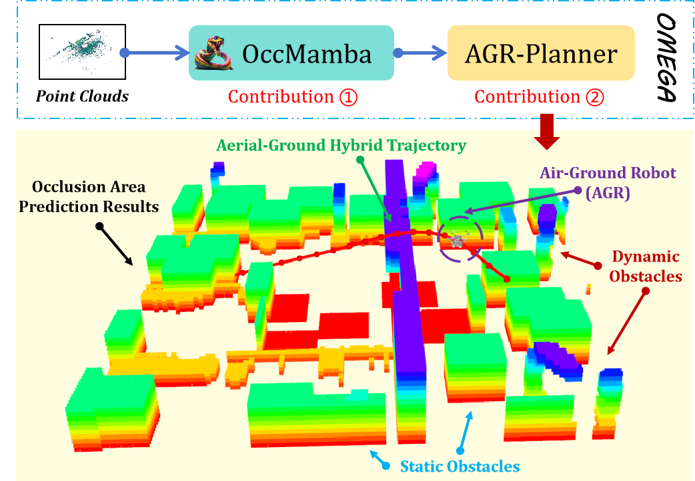

<div align="center">
    <h1>🤖 OMEGA</h1>
    <h2>Efficient Occlusion-Aware Navigation for Air-Ground Robot in Dynamic Environments via State Space Model</h2> <br>
     <a href='https://jmwang0117.github.io/OMEGA/'>Project_Page</a>
</div>

## 📢 News
* **[01/07/2024]**: OccMamba’s [results](https://connecthkuhk-my.sharepoint.com/:t:/g/personal/u3009632_connect_hku_hk/EReNqjk3AehAuvCllef7I6ABEbyl1yu2oPuQ2eYcv5Ad5A?e=RQMFSt) on the SemanticKITTI hidden official test dataset are available for download. 
* **[28/06/2024]**: The pre-trained model can be downloaded at  [OneDrive](https://connecthkuhk-my.sharepoint.com/:u:/g/personal/u3009632_connect_hku_hk/Edm7rZiSH3hBu_vxRJasn1wB7vPTqRWYiDgd9LcZFKbJjQ?e=mlBIfl)
* **[26/06/2024]**: OccMamba [test logs](https://connecthkuhk-my.sharepoint.com/:u:/g/personal/u3009632_connect_hku_hk/ETOLWBP4jrxEvi3ZMwS8HK0Bx2yNa_xWvN-otg6ICMuzdw?e=sREpfK) and [evaluation logs](https://connecthkuhk-my.sharepoint.com/:u:/g/personal/u3009632_connect_hku_hk/EYGHa-8YDBlOs7nypxZEeREBStnS2eSOamYFIHU3s0sh5g?e=K4oJ5W)  on SemanticKITTI are available for download.
* **[25/06/2024]**: OccMamba code has been released.


## 📜 Introduction

**OMEGA** emerges as the pioneering navigation system tailored for AGRs in dynamic settings, with a focus on ensuring occlusion-free mapping and pathfinding. It incorporates OccMamba, a module designed to process point clouds and perpetually update local maps, thereby preemptively identifying obstacles within occluded areas. Complementing this, AGR-Planner utilizes up-to-date maps to facilitate efficient and effective route planning, seamlessly navigating through dynamic environments. 


<p align="center">
  
</p>


```
@article{wang2024omega,
title={OMEGA: Efficient Occlusion-Aware Navigation for Air-Ground Robot in Dynamic Environments via State Space Model},
author={Wang, Junming and Huang, Dong and Sun, Zekai and Guan, Xiuxian and Shen, Tianxiang and Liu, Fangming and Cui, Heming},
year={2024}
      } 
```

Please kindly star ⭐️ this project if it helps you. We take great efforts to develop and maintain it 😁.

## 🛠️ Installation

## TODO


## Dataset

- [x] SemanticKITTI


## 🤗 AGR-Family Works

* [OMEGA](https://jmwang0117.github.io/OMEGA/) (Submitted to RA-L'24): The First Aerial-Ground Robot Navigation System in Dynamic Environments.
* [AGRNav](https://github.com/jmwang0117/AGRNav) (ICRA'24): The First Aerial-Ground Robot Navigation System with Occlusion Awareness.


## Acknowledgement
Many thanks to these excellent open source projects:
- [AGRNav](https://github.com/jmwang0117/AGRNav)
- [Prometheus](https://github.com/amov-lab/Prometheus)
- [SSC-RS](https://github.com/Jieqianyu/SSC-RS)
- [semantic-kitti-api](https://github.com/PRBonn/semantic-kitti-api)
- [Terrestrial-Aerial-Navigation](https://github.com/ZJU-FAST-Lab/Terrestrial-Aerial-Navigation)
- [EGO-Planner](https://github.com/ZJU-FAST-Lab/ego-planner-swarm)

